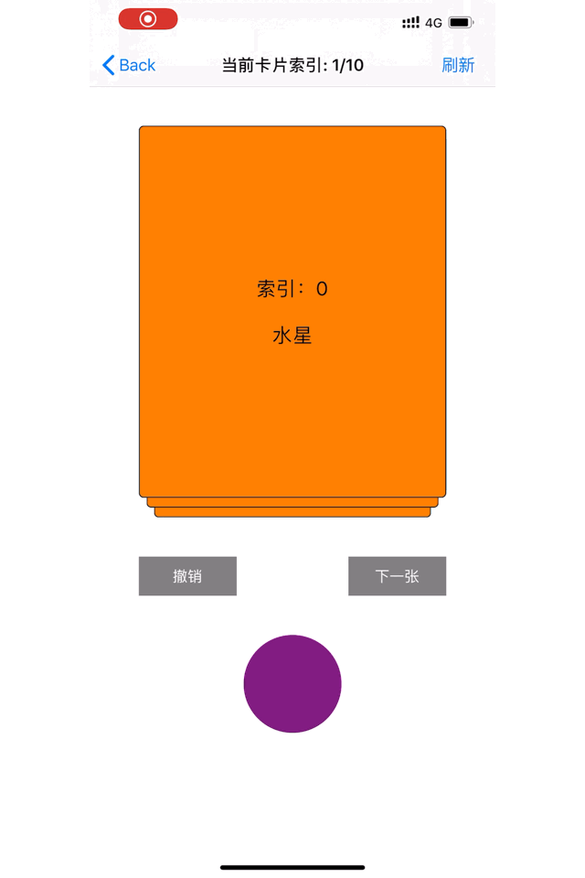

# YHDragContainer
高度还原类似探探等社交应用的滑牌效果。(OC+Swift)

# 为什么写这个库?
由于项目原因，我经常需要用到滑牌效果。最开始，我也是在网上找各种三方库，也的确找到了一些，但是都不是很满意，要么某些我想要的功能没有，要么就是感觉滑牌效果不好，要么就是有些Bug，导致我总是要去改动源码。这样折腾了几次之后，我决定自己写一个，因此就有了这个库。

# 与其他三方库对比
本人参考了一些其他开源库，给了我很多灵感，在此表示感谢:<br>
[CCDraggableCard](https://github.com/liuzechen/CCDraggableCard-Master)<br>
[QiCardView](https://github.com/QiShare/QiCardView)<br>
但是我觉得这些开源库有些不足的地方:<br>
`CCDraggableCard`:只是对卡片的宽做了缩放，没有对高做缩放，另外，其还可以滑动和点击没有显示在最顶部的卡片，而且其没有提供当前滑动索引的方法，并且其属性在框架内部写死了，不能灵活配置。之前在使用的时候，由于这些原因导致我改动了大量的源代码。<br>
`QiCardView`:没有提供卡片的点击事件，并且在滑动过程中没有对下层卡片做处理
综合上述原因，本人决定自己写一个扩展性好，可以灵活配置各种属性的滑牌库。<br><br>
与其他的同类三方库对比的优点：
- 可以无限滑动
- 可以上下左右滑动
- 滑牌属性可以自由定制
- 通过数据源的方式来控制滑牌，内存占用低
- 代理丰富，可以根据自己的需要来选择合适的代理

## 即将加入的功能
暂无
## 效果预览


## 安装

### 手动
- OC<br>
Clone代码，把OC Demo里面的`Sources`文件夹拖入项目，#import "YHDragCardContainer.h"，就可以使用了
- Swift<br>
Clone代码，把Swift Demo里面的`Sources`文件夹拖入项目就可以使用了

### CocoaPods
- OC

```
pod 'YHDragContainer'
```
- Swift

```
pod 'YHDragCard.swift'
```
如果提示未找到，先执行`pod repo update`，再执行`pod install`

## 使用
- 👉OC（具体用法请看Demo，以及框架里面的注释，写的很详细）

```
YHDragCardContainer *card = [[YHDragCardContainer alloc] initWithFrame:CGRectMake(50, [UIApplication sharedApplication].statusBarFrame.size.height+44+40, self.view.frame.size.width - 100, 400)];
card.delegate = self;
card.dataSource = self;
card.minScale = 0.9;
card.removeDirection = YHDragCardRemoveDirectionHorizontal;
[self.view addSubview:card];
```

- 👉Swift（具体用法请看Demo，以及框架里面的注释，写的很详细）

```
let card = YHDragCard(frame: CGRect(x: 50, y: UIApplication.shared.statusBarFrame.size.height + 44.0 + 40.0, width: self.view.frame.size.width - 100 , height: 400))
card.dataSource = self
card.delegate = self
card.minScale = 0.9
card.removeDirection = .horizontal
self.view.addSubview(card)
```


## 更新记录(倒叙)

### 3、(2019.10.08)<br>

###### OC 0.6.0版本<br>
- OC版本重构，优化代码<br>

###### Swift 0.6.0版本<br>
- 增加Swift版本

### 2、OC 0.5.0版本(2019.6.20)
- 增加禁用拖动手势的功能

### 1、OC 0.4.0版本(2019.6.13)
- 增加撤销功能
- 增加往上滑动和往下滑动的回调

## 补充
该仓库会不断进行优化，在使用过程中，有任何建议或问题，欢迎提issue，或者通过邮箱1035841713@qq.com联系我<br>
喜欢就star❤️一下吧
