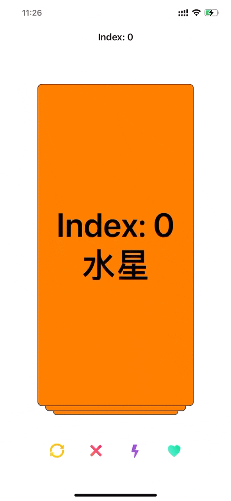

# DragCardContainer

A multi-directional card swiping library inspired by Tinder and TanTan.

## Introduction

Due to project reasons, I often need to use the card sliding effect. At the beginning, I also searched for various three-party libraries on GitHub. Fortunately, I found it. But I am not very satisfied, either some of the functions I want are missing, or I feel that the sliding effect of the card is not good, or there are some bugs, and finally I have to modify the source code. After tossing around like this a few times, I decided to write one.

I refer some third-party libraries:

- [CCDraggableCard](https://github.com/liuzechen/CCDraggableCard-Master)
- [QiCardView](https://github.com/QiShare/QiCardView)
- [ZLSwipeableViewSwift](https://github.com/zhxnlai/ZLSwipeableViewSwift)
- [Shuffle](https://github.com/mac-gallagher/Shuffle)

## Features

- Advanced swipe recognition based on velocity and card position.
- Multiple built-in card stacking styles.
- Manual and programmatic actions.
- Smooth card overlay view transitions.
- Similar to UITableView, dynamic card loading using data source pattern.

## Preview



## Getting Start

### Requirements

- Deployment target iOS 11.0+
- Swift 5+
- Xcode 14+

### Installation

#### CocoaPods

```ruby
pod 'DragCardContainer'
```

Or

```ruby
pod 'DragCardContainer', :git => "https://github.com/liujunliuhong/DragCardContainer.git"
```

### Usage

#### Setting up the card view

Create your own card container and setting its properties directly.

```swift
let cardContainer = DragCardContainer()
// 是否可以无限滑动
cardContainer.infiniteLoop = false
// 数据源
cardContainer.dataSource = self
// 代理
cardContainer.delegate = self
// 可见卡片数量
cardContainer.visibleCount = 3
// 是否可以打印日志
cardContainer.enableLog = true
// 是否禁用卡片拖动
cardContainer.disableTopCardDrag = false
// 是否禁用卡片点击
cardContainer.disableTopCardClick = false
```

#### Mode

You can custom `mode`. `Mode` is a protocol, `ScaleMode` implements the `Mode` protocol.

```swift
let mode = ScaleMode()
// 卡片之间间距
mode.cardSpacing = 10
// 方向（可以运行Demo，修改该参数看实际效果）
mode.direction = .bottom
// 最小缩放比例
mode.minimumScale = 0.7
// 卡片最大旋转角度
mode.maximumAngle = 0
// 赋值mode
cardContainer.mode = mode
```

#### Configuring the card

Custom Card, inherited from `DragCardView`.

```swift
public final class CardView: DragCardView { }
```

#### Configuring the datasource

You must conform the protocol `DragCardDataSource`.

```swift
public func numberOfCards(_ dragCard: DragCardContainer) -> Int {
    return 10
}

public func dragCard(_ dragCard: DragCardContainer, viewForCard index: Int) -> DragCardView {
    let cardView = CardView()
    cardView.allowedDirection = [.left, .right]
    return cardView
}
```

#### Configuring the delegate

The protocol `DragCardDelegate` is optional.

```swift
public func dragCard(_ dragCard: DragCardContainer, displayTopCardAt index: Int, with cardView: DragCardView) {
    print("displayTopCardAt: \(index)")
}

public func dragCard(_ dragCard: DragCardContainer, didRemovedTopCardAt index: Int, direction: Direction, with cardView: DragCardView) {
    print("didRemovedTopCardAt: \(index)")
}

public func dragCard(_ dragCard: DragCardContainer, didRemovedLast cardView: DragCardView) {
    print("didRemovedLast")
}

public func dragCard(_ dragCard: DragCardContainer, didSelectTopCardAt index: Int, with cardView: DragCardView) {
    print("didSelectTopCardAt: \(index)")
}
```

#### Moving Views

##### Swiping programmatically

The user can swipe views in the allowed directions. This can also happen programmatically.

```swift
cardContainer.swipeTopCard(to: .right)
```

##### Rewinding

Returns the most recently swiped card to the top of the card stack.

```swift
cardContainer.rewind(from: .right)
```

#### Set top level card index

You can set top level card index.

```swift
cardContainer.currentTopIndex = 2
```

### Author

liujun, universegalaxy96@gmail.com
